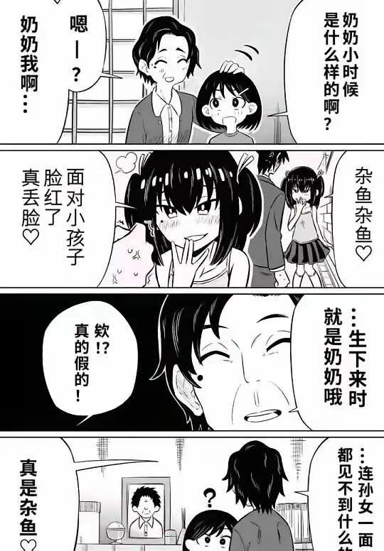

# 奶奶小時候是什麼樣的？雜魚雜魚♡

**一句話**：「奶奶小時候是什麼樣的？」——回憶：她是對大人說「雜魚雜魚♡」的雌小鬼。「就是生下來時的奶奶哦……」最後對著爺爺的遺照：「連孫女一面都見不到，真是雜魚♡。」

## 🍸 笑點解說
- **背景知識**：「雌小鬼」是 ACG 圈的角色類型，指愛嘲諷大人「雜魚（ざこ）」的囂張小女孩。
- **梗在哪**：雌小鬼長大變成慈祥奶奶，但本性一輩子沒改。
