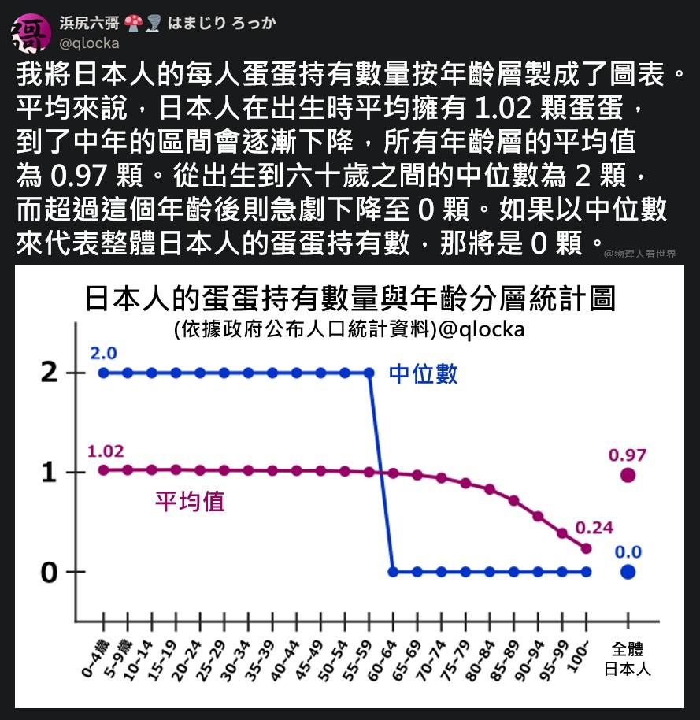

# 日本人的蛋蛋持有數量統計圖

**一句話**：依年齡層畫出日本人的平均蛋蛋數——平均值從 1.02 緩緩降到 0.24；中位數 60 歲前都是 2，之後直接掉到 0。全體日本人的中位數：0 顆。

## 🍸 笑點解說
- **背景知識**：中位數是把資料排序後正中間那個值；平均值則會被所有人拉動。
- **梗在哪**：日本女性比男性多，所以全體的中位數是 0——用最荒謬的例子示範「中位數與平均值可以天差地遠」。
