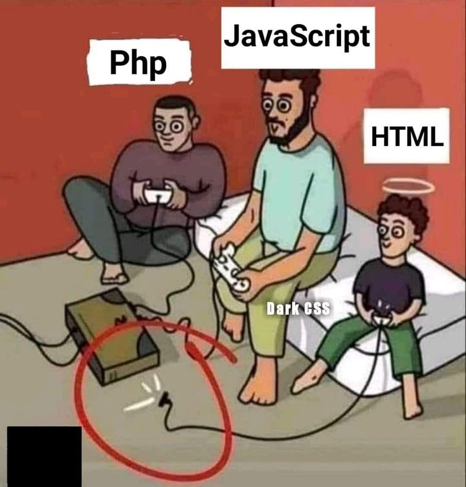

# PHP、JavaScript、HTML 一起打電動——HTML 的手把根本沒插

**一句話**：PHP 和 JavaScript 認真打電動，頭頂光環的 HTML 小弟也開心地握著手把——但他的手把線根本沒插上主機。

## 🍸 笑點解說
- **梗在哪**：這是「給弟弟拔掉插頭的手把」梗。HTML 是標記語言，不是程式語言，沒有邏輯與運算能力——工程師常開玩笑說它「以為自己在寫程式」。
