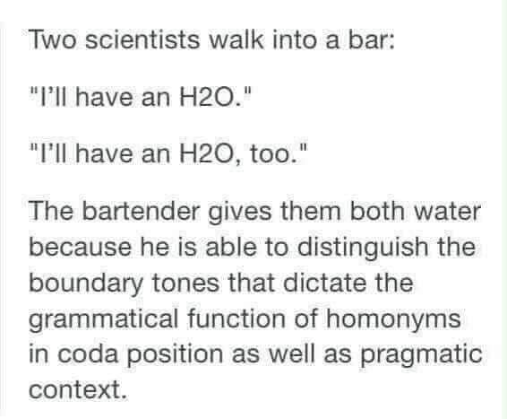

# 兩個科學家走進酒吧：H2O too

**一句話**：「我要一杯 H2O。」「我也要一杯 H2O, too。」——酒保給兩人都倒了水，因為他能分辨句尾同音詞的邊界語調和語用脈絡。

## 🍸 笑點解說
- **梗在哪**：原版笑話是「H2O too」聽起來像「H2O2」（雙氧水），第二個科學家喝了就掛了。這個版本故意用語言學術語把笑點拆掉：too 在句尾的語調和 two 不同，加上點飲料的情境，正常人不會聽錯。反高潮本身就是笑點。
