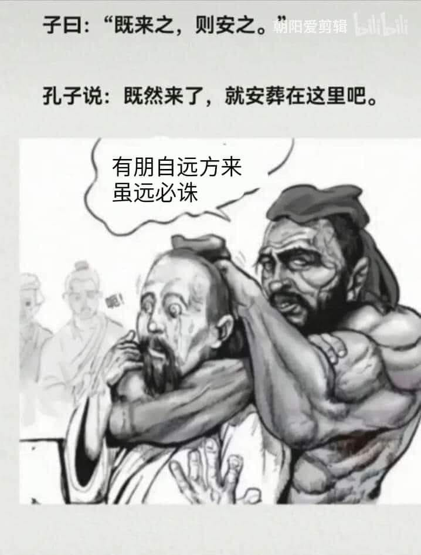

# 子曰：既來之，則安之（安葬在這裡）

**一句話**：「既來之，則安之」被翻成「既然來了，就安葬在這裡吧」；「有朋自遠方來」接「雖遠必誅」，配圖是壯漢勒住孔子。

## 🍸 笑點解說
- **梗在哪**：原句出自《論語》，意思是「既然讓他們來了，就讓他們安定下來」。這裡把「安」曲解成「安葬」，再把「有朋自遠方來」（論語）接上漢朝陳湯的「雖遠必誅」，溫文儒雅的孔子名言瞬間變成殺氣騰騰的威脅。
