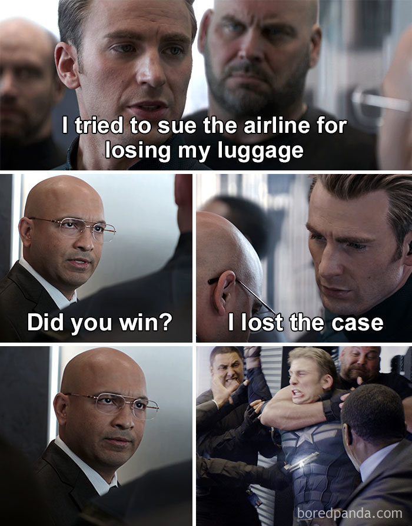

# 告航空公司弄丟行李：I lost the case

**一句話**：「我告航空公司弄丟我的行李。」「贏了嗎？」「I lost the case.」——然後電梯裡所有人一起撲上去制伏他。

## 🍸 笑點解說
- **梗在哪**：case 既是「官司」也是「箱子」。I lost the case 可以是「我輸了官司」，也可以是「我弄丟了箱子」（所以才要告）。冷笑話講完，套用《美國隊長2》電梯打鬥場景，全電梯的人受不了直接動手。
