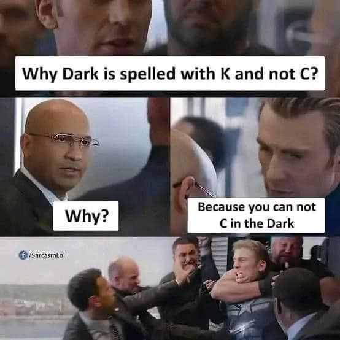

# 為什麼 Dark 用 K 不用 C？

**一句話**：「為什麼 Dark 用 K 拼而不是 C？」「為什麼？」「因為在黑暗中你看不到（can't C/see）。」——電梯裡所有人撲上去制伏他。

## 🍸 笑點解說
- **梗在哪**：字母 C 和 see 同音，you can't see in the dark 變成 you can't C in the dark，所以 dark 裡不能有 C。又是《美國隊長2》電梯模板：冷笑話講完就被圍毆。
