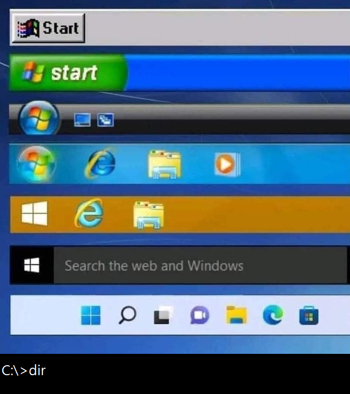

# Windows 工作列演化史：最後是 C:\>dir

**一句話**：從 Windows 95 的 Start、XP 綠色 start、Vista/7 圓球、8、10 一路到 11，最下面卻是黑底的 `C:\>dir`。

## 🍸 笑點解說
- **梗在哪**：一張圖列出 Windows 歷代工作列，看似一路進化，最後一格卻是 DOS 命令列。真正的電腦老手根本不用開始選單，打 `dir` 列目錄就好；也暗示繞了一大圈，最強的介面還是命令列。
