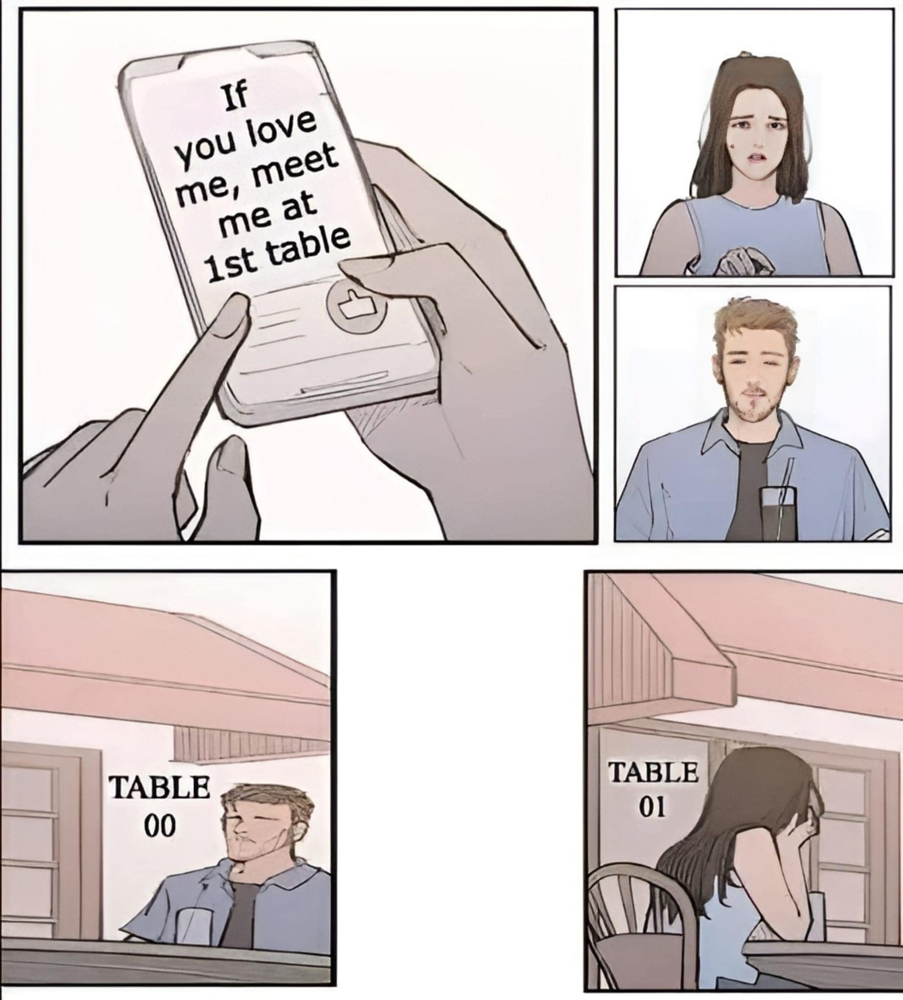

# 在第一桌等我：Table 00 還是 Table 01？

**一句話**：「如果你愛我，就在第一桌等我。」結果男生坐在 TABLE 00，女生坐在 TABLE 01，兩個人都在等對方沒來。

## 🍸 笑點解說
- **梗在哪**：大多數程式語言的陣列索引從 0 開始，所以工程師眼中的「第一個」是編號 0；一般人的「第一個」是編號 1。同一句「1st table」被兩種計數習慣各自解讀，愛情就這樣錯過了。
