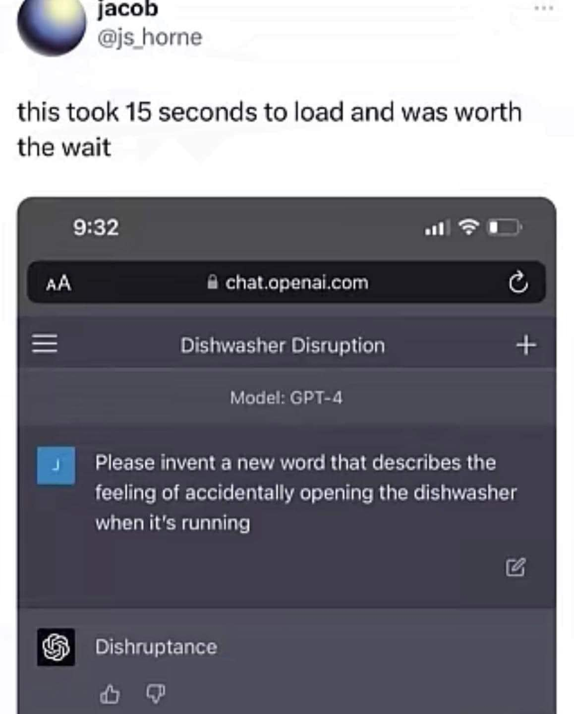

# GPT-4 等了 15 秒發明的新字：Dishruptance

**一句話**：請 GPT-4 發明一個新字，描述「不小心在洗碗機運轉時打開它」的感覺，等了 15 秒，它回答：Dishruptance。

## 🍸 笑點解說
- **梗在哪**：把 dish（碗盤）和 disruptance（打擾）混在一起，字面上就是「被碗盤打擾」，同時也保留 disruption（中斷）的意思。一個字同時點出洗碗機和被打斷的狀況，推主覺得等 15 秒很值得。
