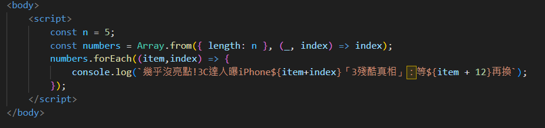

# 用 for 迴圈自動產生年度 iPhone 新聞標題

**一句話**：一段 JavaScript 用 forEach 迴圈印出「幾乎沒亮點！3C 達人曝 iPhone${n}『3 殘酷真相』：等${n+1}再換」——新聞稿直接用程式批次生成。

## 🍸 笑點解說
- **梗在哪**：每年新 iPhone 發表，新聞都會出現幾乎一模一樣的「等下一代再換」標題，只改數字。寫成程式模板就能一次產生所有年份。
- 附帶一個 bug：程式寫的是 `${item+index}`，item 和 index 相等，印出來會是 iPhone 0、2、4、6、8，而不是連續的數字；貼圖者另外貼了改成 `item+11` 的修正版。
