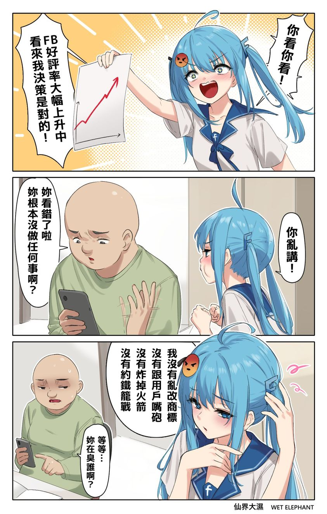

# FB 好評率大幅上升：我沒有亂改商標、沒有炸掉火箭

**一句話**：FB 娘開心炫耀「好評率大幅上升，看來我的決策是對的！」大叔說「妳看錯了啦，妳根本沒做任何事啊？」FB 娘：「我沒有亂改商標、沒有跟用戶嘴砲、沒有炸掉火箭、沒有約鐵籠戰。」「等等……妳在臭誰啊？」

## 🍸 笑點解說
- **梗在哪**：她列的每一條都是 2023 年馬斯克做的事：把推特改名成 X、在推特上跟網友吵架、SpaceX 星艦試射爆炸、約祖克柏打鐵籠格鬥。FB 什麼都沒做，只是對手一直自爆，評價就自動變好了。
