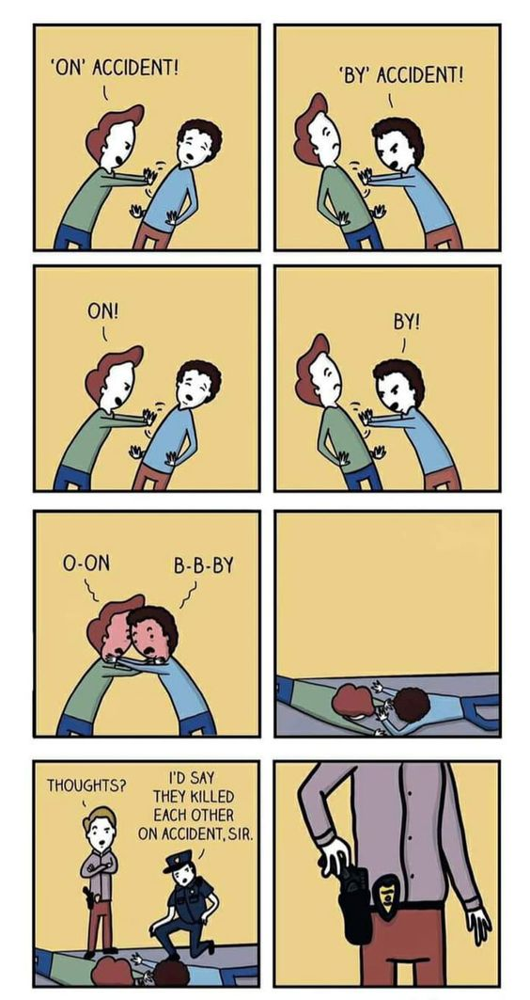

# On accident 還是 By accident？吵到同歸於盡

**一句話**：兩人吵「是 ON accident！」「是 BY accident！」越推越用力，最後一起摔下去。警探問「你怎麼看？」警察：「我會說他們是 on accident 殺死彼此的，長官。」——警探默默拔出槍。

## 🍸 笑點解說
- **梗在哪**：「意外地」正確用法是 by accident，on accident 是美國口語常見的錯用，英文圈常為此吵架。警察說出 on accident，站在 by accident 那邊的警探直接準備動手，爭論繼續升級。
