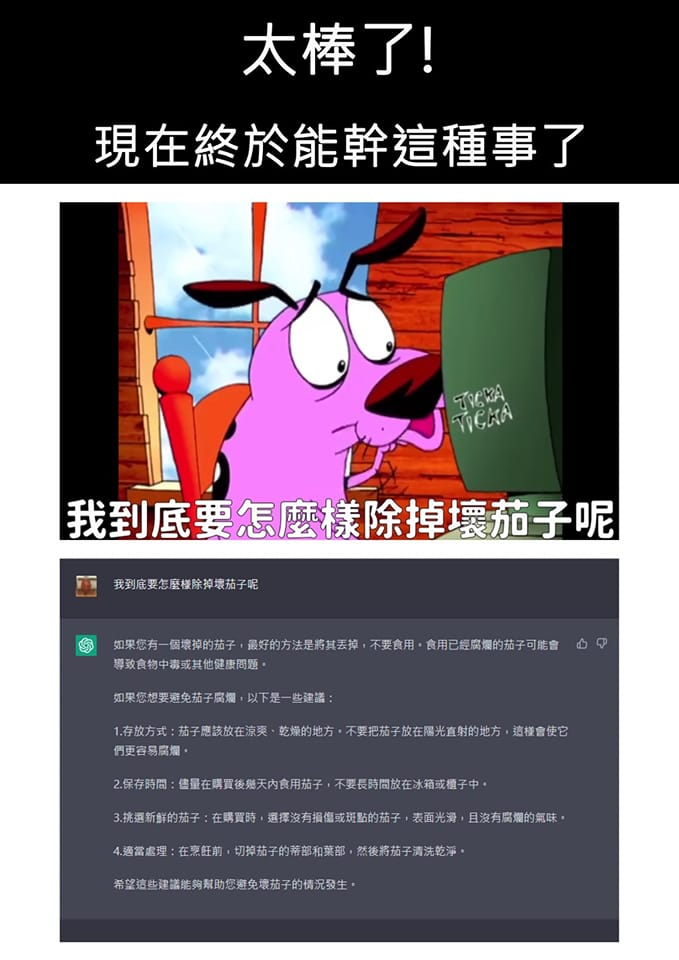

# 太棒了！現在終於能幹這種事了：問 ChatGPT 怎麼除掉壞茄子

**一句話**：膽小狗英雄在電腦前打字：「我到底要怎麼樣除掉壞茄子呢？」ChatGPT 認真回答：壞掉的茄子最好丟掉，並列出存放方式、保存時間、挑選新鮮茄子的建議。

## 🍸 笑點解說
- **梗在哪**：《膽小狗英雄》有一集經典反派是一顆會說話的邪惡茄子，膽小狗在電腦上問「如何除掉壞茄子」。ChatGPT 完全不懂這個梗，把它當成真的蔬菜保存問題回答。
