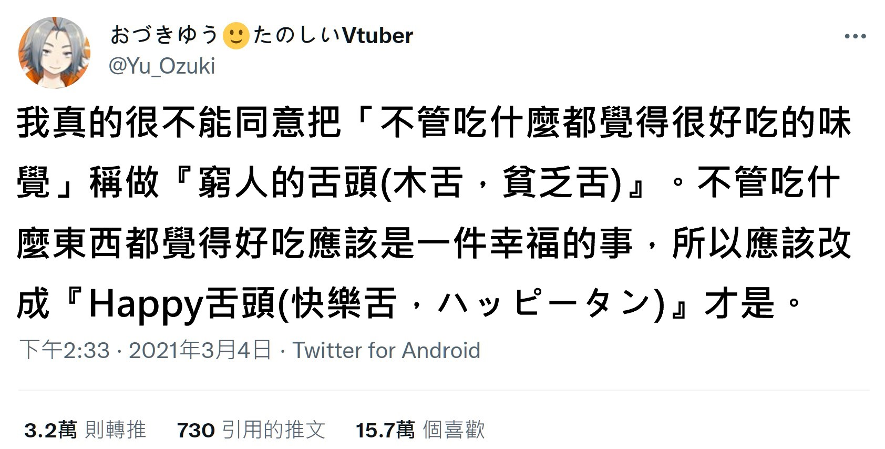

# 不管吃什麼都好吃，不是「貧乏舌」而是「Happy 舌」

**一句話**：「我不能同意把『不管吃什麼都覺得很好吃的味覺』稱做『窮人的舌頭（貧乏舌）』，應該改成『Happy 舌頭（ハッピータン）』才是。」

## 🍸 笑點解說
- **梗在哪**：日文「貧乏舌（びんぼうじた）」是嘲笑人味覺差、什麼都覺得好吃。推主提議改成「ハッピータン」：舌頭的日文外來語「タン（tongue）」接上 Happy，同時也是日本一款很有名的米果零食「Happy Turn（ハッピーターン）」的諧音。
