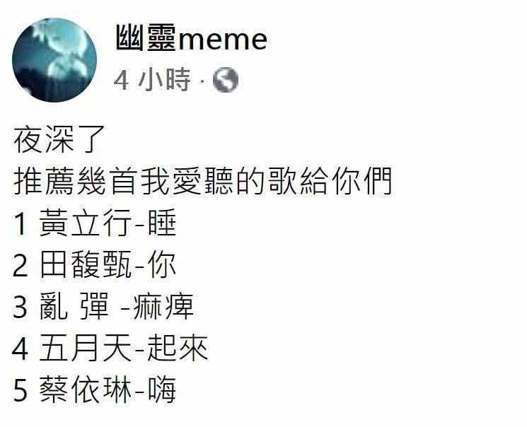

# 夜深了推薦幾首歌：黃立行〈睡〉、田馥甄〈你〉、亂彈〈痲痺〉

**一句話**：「夜深了，推薦幾首我愛聽的歌給你們：1 黃立行〈睡〉、2 田馥甄〈你〉、3 亂彈〈痲痺〉、4 五月天〈起來〉、5 蔡依林〈嗨〉。」

## 🍸 笑點解說
- **梗在哪**：把五首歌名連起來讀就是「睡你痲痺，起來嗨」，這是中國網路上一句流行的粗口口號（叫人別睡了起來玩）。表面上是睡前推薦歌單，實際上是叫你別睡。
