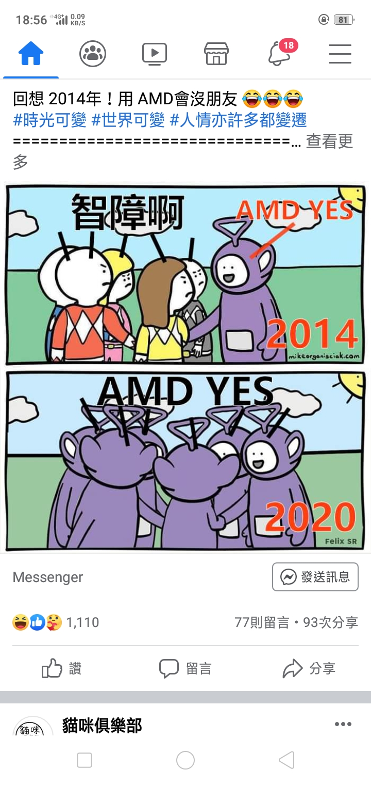

# 2014 年說 AMD YES 會沒朋友，2020 年大家都在喊

**一句話**：2014 年，紫色天線寶寶說「AMD YES」，其他人（戰隊成員）一臉嫌棄：「智障啊。」2020 年，大家都變成紫色天線寶寶，一起喊「AMD YES」。

## 🍸 笑點解說
- **梗在哪**：2014 年前後 AMD 的 CPU 效能遠落後 Intel，推 AMD 會被嘲笑；2017 年後 AMD 推出 Ryzen 系列大翻身，到 2020 年性價比壓過 Intel，「AMD YES」成了整個硬體圈的口號。
