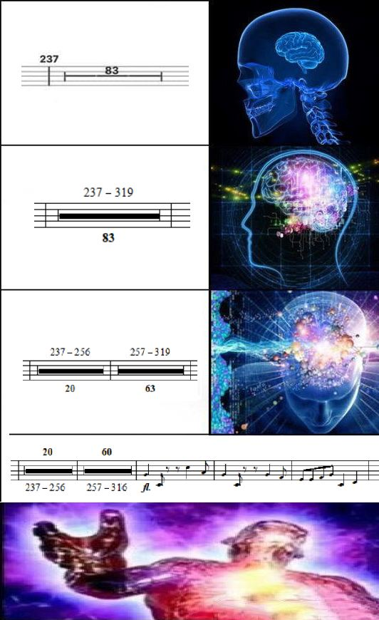

# 樂譜休止小節的銀河腦：83 → 20＋63 → 20＋60

**一句話**：長休止記號從「237 小節起休息 83 小節」，變成「237–319」，再拆成「237–256（20）＋257–319（63）」，最後一格是「20＋60（237–316）」後面緊接著一串音符。

## 🍸 笑點解說
- **梗在哪**：樂手遇到長休止要自己默數小節數，數錯就會搶拍或漏進。這張譜越寫越刁鑽，最後把休止拆成奇怪的段落、還在中間提前進場，像作曲者在挑戰樂手數小節的極限。
