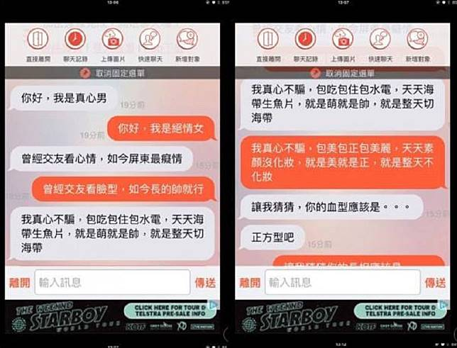

# 聊天軟體的真心男 vs 絕情女：一路互尬到底

**一句話**：「你好，我是真心男。」「你好，我是絕情女。」接下來雙方用押韻與雙關一路互尬（原圖共四頁）：「你的血型應該是……正方型吧」「你的長相應該是……大象吧」「很有安全感呀」「很有溫和感呀」；「你一定正翻了」「錯，我出的是紅中」「東南西北中發白」「吃碰槓我樣樣都行」；「我有三個兄弟，大哥叫東眼、二哥南耳、三哥西口，我叫什麼？」「叫北七。」

## 🍸 笑點解說
- **梗在哪**：兩人把搭訕變成諧音攻防戰。「北七」是台語「白痴」（pe̍h-tshi）的常見寫法，剛好接在東西南「北」後面。
