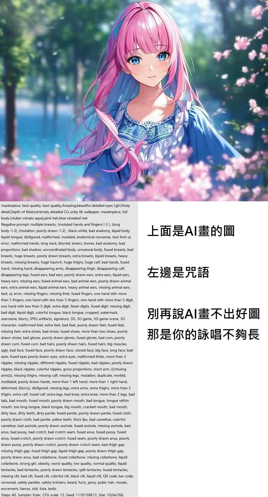

# 別再說 AI 畫不出好圖，那是你的詠唱不夠長

**一句話**：上面是一張 AI 畫的漂亮少女，左邊是它的「咒語」——落落長的提示詞與上百個負面提示詞（各種畸形手、多餘手指、崩壞身體部位……）。「別再說 AI 畫不出好圖，那是你的詠唱不夠長。」

## 🍸 笑點解說
- **梗在哪**：AI 繪圖的 prompt 被戲稱為「詠唱咒語」。負面提示詞要把 AI 常畫錯的東西一條條列出來禁止，長到像在念經。
