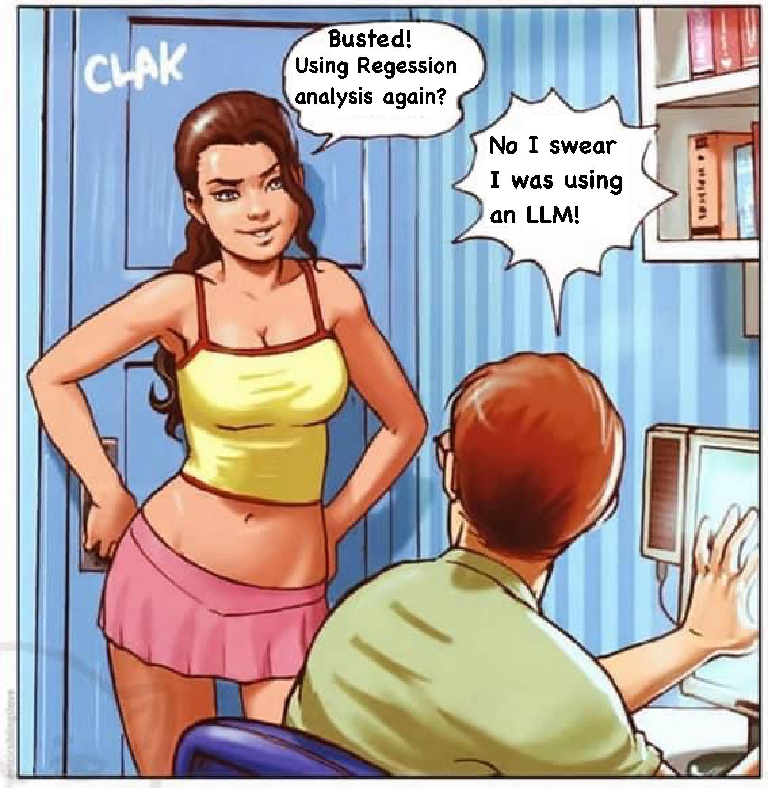

# 被抓到又在用迴歸分析？我發誓我是在用 LLM！

**一句話**：女生推開房門：「Busted! Using Regression analysis again?」男生慌張地遮螢幕：「No I swear I was using an LLM!」

## 🍸 笑點解說
- **梗在哪**：套用「被抓到在看色情」的漫畫模板，把見不得人的東西換成老派的迴歸分析，辯解則是「我是在用 LLM」——大家都說在做 AI，其實很多東西本質上就是迴歸。
