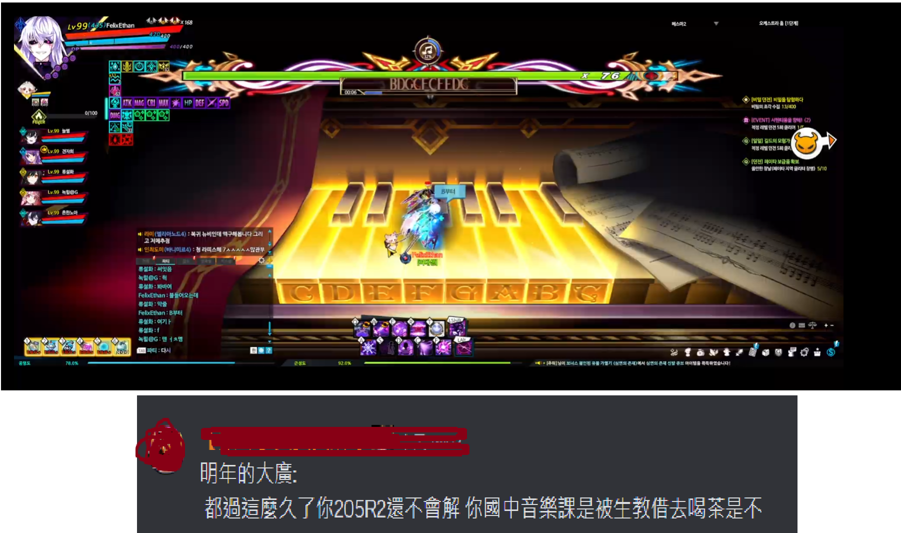

# 都過這麼久了你還不會解鋼琴關卡，國中音樂課是被生教借去喝茶是不

**一句話**：遊戲畫面裡角色站在巨大的琴鍵上，要照上方的音名「BDGCEFCFFDG」依序踩鍵；留言：「明年的大廣：都過這麼久了你 205R2 還不會解，你國中音樂課是被生教借去喝茶是不。」

## 🍸 笑點解說
- **梗在哪**：關卡只要看得懂 C～B 的音名就能解，但台灣國中的音樂課常被其他科老師「借課」，留言嘲諷玩家根本沒上過音樂課。
