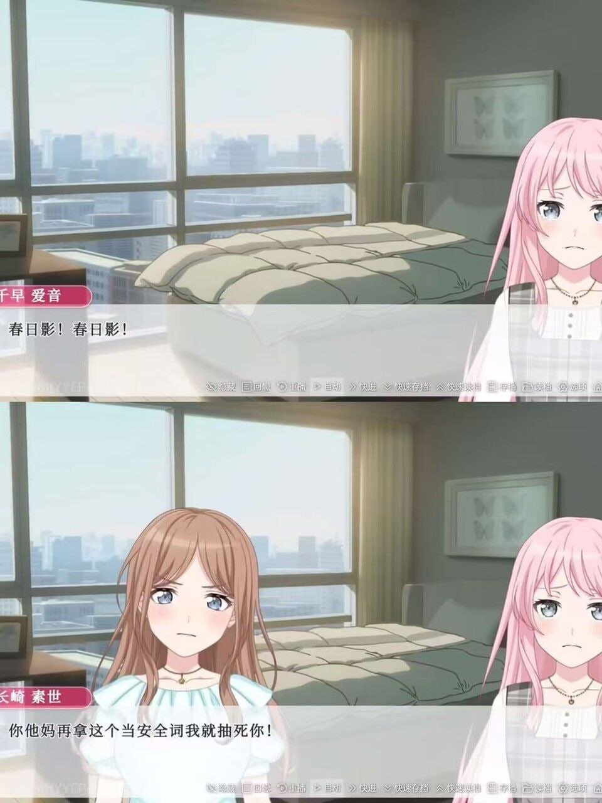

# 春日影！春日影！——你他媽再拿這個當安全詞我就抽死你！

**一句話**：遊戲對話框：千早愛音：「春日影！春日影！」長崎素世：「你他媽再拿這個當安全詞我就抽死你！」

## 🍸 笑點解說
- **梗在哪**：《BanG Dream! It's MyGO!!!!!》裡，〈春日影〉是長崎素世（祥子前樂團）心中的禁忌之歌，被人唱就會崩潰——「為什麼要演奏春日影！」已經是名梗。這裡愛音把它當成 SM 的安全詞，素世當然暴怒。
