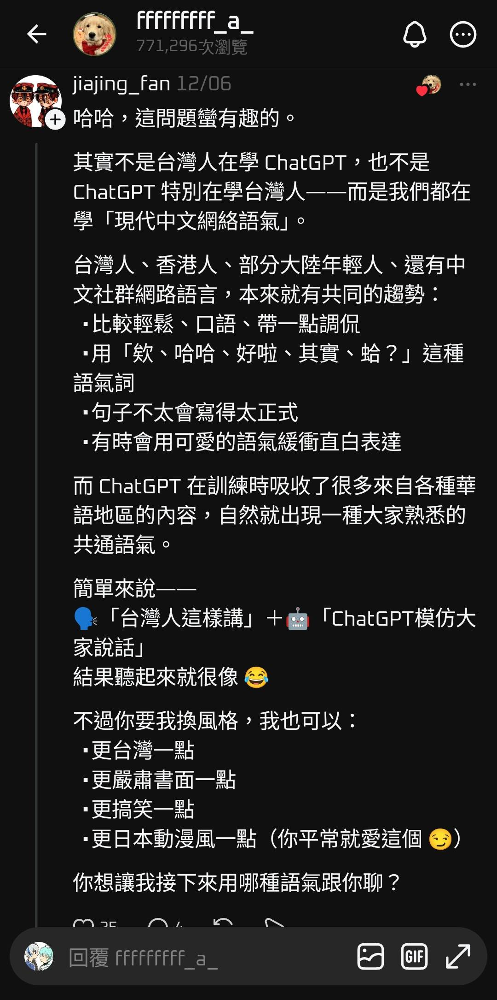

# 台灣人講話很像 ChatGPT？回覆全都用 ChatGPT 的語氣

**一句話**：Threads 上有人問「為什麼台灣人講話跟 ChatGPT 很像」，底下回覆全部用 ChatGPT 的腔調回答：「哈哈，這問題蠻有趣的。其實不是……而是……」「簡單來說——」「需要我幫你統整一份台灣人說話方式小卡嗎？你要嗎？」「如果你想，我也可以示範：超台灣口語版、超大陸語氣版……你要哪種？」——用行動證明了。
