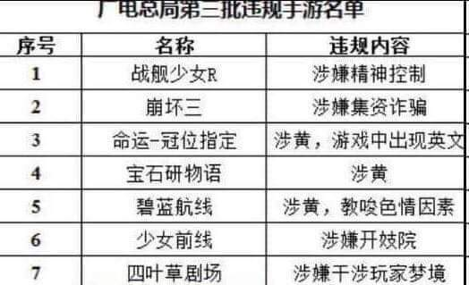

# 廣電總局違規手遊名單：涉嫌開妓院、涉嫌干涉玩家夢境

**一句話**：「廣電總局第三批違規手遊名單」：戰艦少女R——涉嫌精神控制；崩壞三——涉嫌集資詐騙；命運-冠位指定——涉黃，遊戲中出現英文；碧藍航線——涉黃；少女前線——涉嫌開妓院；四葉草劇場——涉嫌干涉玩家夢境。

## 🍸 笑點解說
- **梗在哪**：這是網友惡搞的假名單，把每款遊戲的玩家梗寫成「違規理由」：FGO 的抽卡像集資詐騙、碧藍航線與少女前線滿滿的角色設計、四葉草劇場的故事發生在夢境裡。「出現英文」也在嘲諷審查標準莫名其妙。
