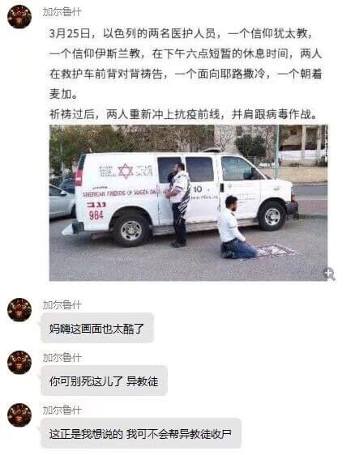

# 猶太教與伊斯蘭教醫護背對背禱告：你可別死這兒了異教徒

**一句話**：新聞：以色列兩名分別信仰猶太教和伊斯蘭教的醫護人員，在救護車前背對背禱告，一個面向耶路撒冷、一個朝著麥加，禱告後並肩抗疫。網友腦補兩人的對話：「媽的這畫面也太酷了」「你可別死這兒了，異教徒」「這正是我想說的，我可不會幫異教徒收屍。」

## 🍸 笑點解說
- **梗在哪**：把感人的宗教和解畫面，配上像動作片搭檔一樣嘴硬又關心對方的台詞。
