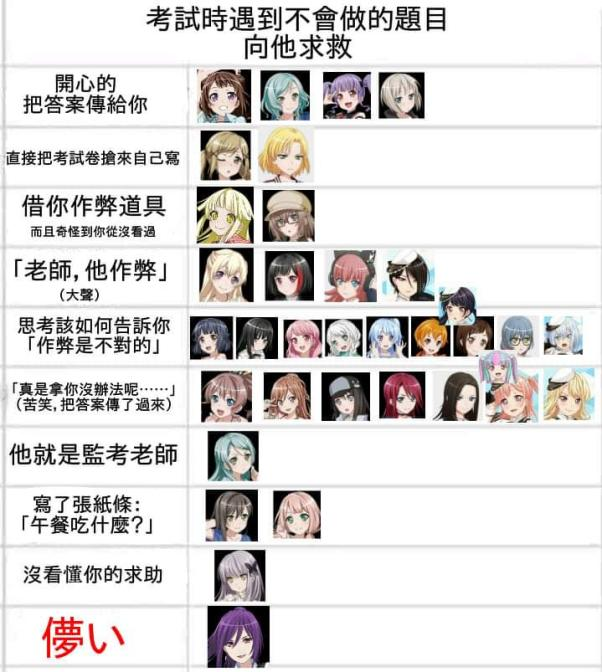

# 考試時遇到不會做的題目，向 BanG Dream 角色求救

**一句話**：分類表「考試時遇到不會做的題目向他求救」：開心地把答案傳給你、直接把考卷搶來自己寫、借你作弊道具、大喊「老師，他作弊」、思考該如何告訴你作弊是不對的、苦笑著把答案傳過來、他就是監考老師、寫紙條「午餐吃什麼？」、沒看懂你的求助——最後一格紅字「儚い」配瀨田薰。

## 🍸 笑點解說
- **梗在哪**：每一格對應《BanG Dream!》樂團角色的個性；瀨田薰的口頭禪是「儚い（虛幻啊）」，不管什麼情況都只會說這句。
