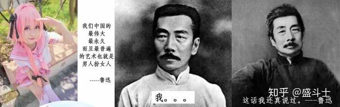

# 魯迅：我們中國最偉大最永久的藝術就是男人扮女人——這話我還真說過

**一句話**：左邊是一位粉紅頭髮的男 coser，配字「我們中國的最偉大最永久而且最普遍的藝術也就是男人扮女人。——魯迅」；中間魯迅：「我。。。」；右邊魯迅：「這話我還真說過。」

## 🍸 笑點解說
- **梗在哪**：網路上常有人亂編名言再掛上「魯迅說」，魯迅本人只好出來否認「這話我沒說過」。這次那句話竟然真的出自魯迅的雜文〈論照相之類〉，反轉成他只好承認。
