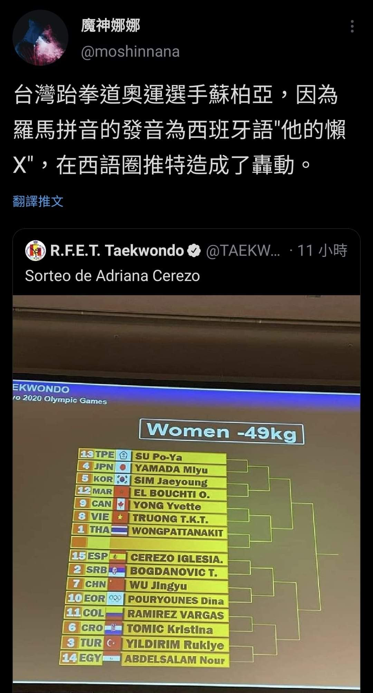

# 台灣跆拳道選手的羅馬拼音在西班牙語圈推特造成轟動

**一句話**：推文：「台灣跆拳道奧運選手蘇柏亞，因為羅馬拼音的發音為西班牙語『他的懶 X』，在西語圈推特造成了轟動。」附上東京奧運女子 49 公斤級的對戰表，第一個就是「SU Po-Ya」。

## 🍸 笑點解說
- **梗在哪**：「Su」在西班牙語是「他的／她的」，「Po-Ya」唸起來像西語俚語裡的男性生殖器，拼起來就成了很尷尬的一句話。
