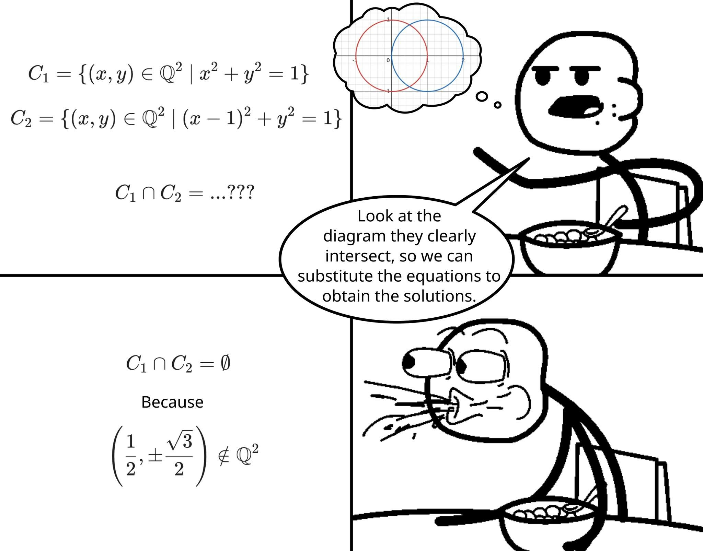

# 兩個有理數圓明明畫起來相交，交集卻是空集合

**一句話**：$C_1 = \{(x,y)\in\mathbb{Q}^2 \mid x^2+y^2=1\}$、$C_2 = \{(x,y)\in\mathbb{Q}^2 \mid (x-1)^2+y^2=1\}$，$C_1\cap C_2 = ?$ 看圖明明兩圓相交，代入就能解——答案卻是 $C_1\cap C_2=\emptyset$，因為 $\left(\frac12,\pm\frac{\sqrt3}{2}\right)\notin\mathbb{Q}^2$，看的人噴出麥片。

## 🍸 笑點解說
- **梗在哪**：兩個圓在實數平面上的交點是 $\left(\frac12,\pm\frac{\sqrt3}{2}\right)$，但 $\sqrt3$ 是無理數，所以只取有理數座標的「圓」根本沒有交點。看圖說話在 $\mathbb{Q}^2$ 裡不成立。
