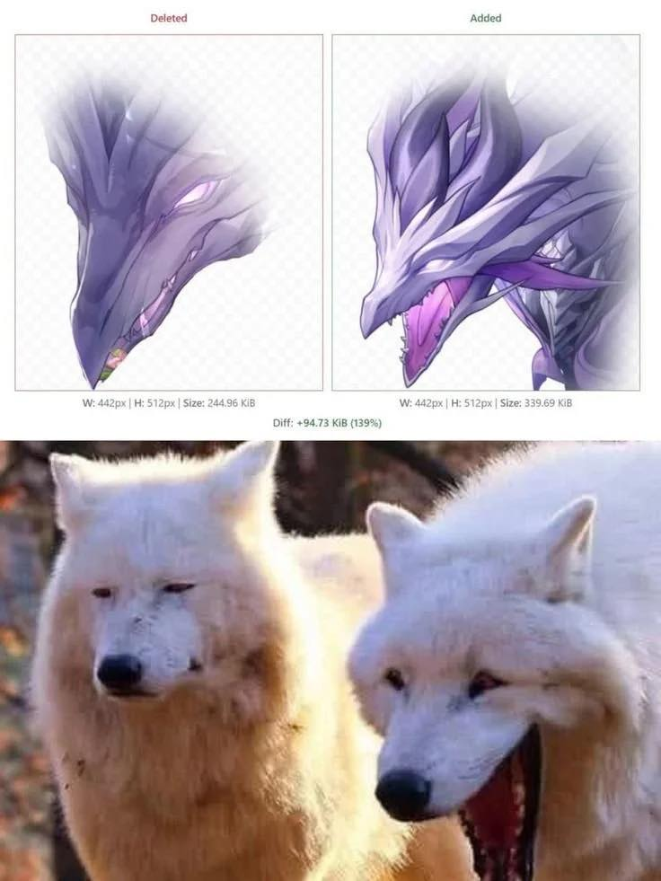

# 崩鐵的龍嘴巴不會張開的 bug 修正前 vs 修正後

**一句話**：上面是遊戲檔案比對：Deleted（修正前）的紫色龍頭閉著嘴，Added（修正後）的龍張開大嘴。下面是一對北極狼：左邊一隻閉嘴、右邊一隻張大嘴——跟上圖一模一樣。

## 🍸 笑點解說
- **梗在哪**：《崩壞：星穹鐵道》某角色的終結技裡，龍明明在噴火，嘴巴卻沒張開，後來官方修正。有人把修正前後的圖和一張有名的「兩隻狼」梗圖並排，剛好完美對應。
