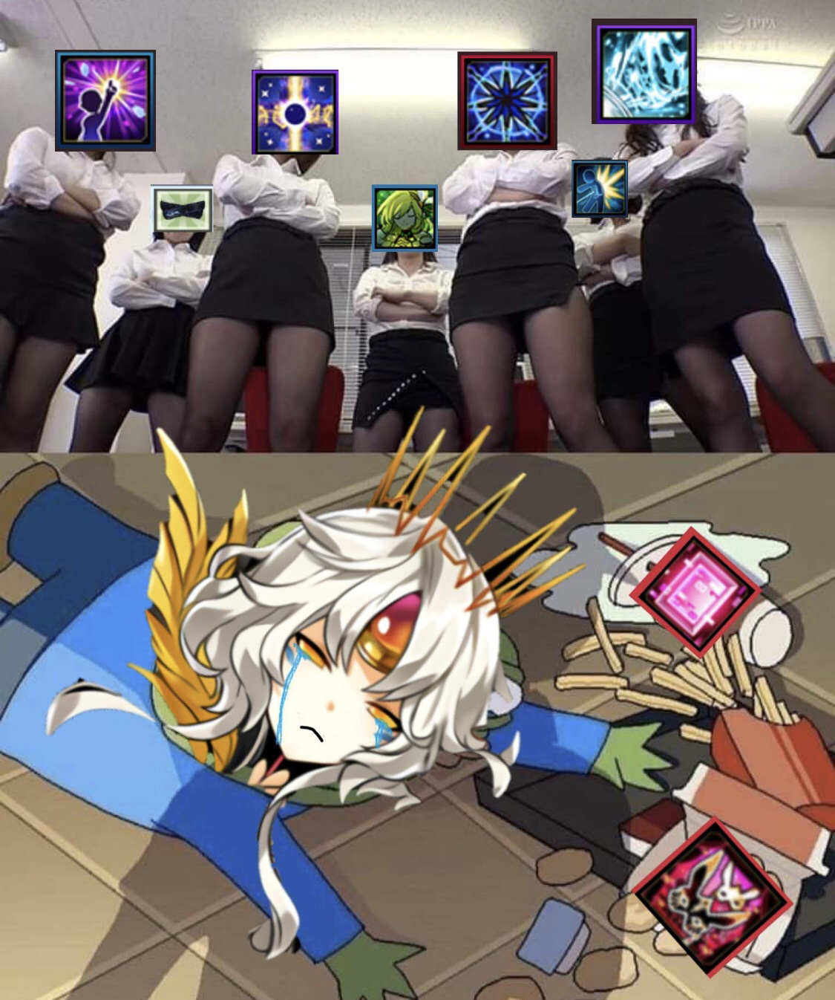

# CA 對上一排都有清除 debuff 技能的角色

**一句話**：上半是一排雙手抱胸、居高臨下的 OL，每個人的臉都被貼上一個艾爾之光的技能圖示；下半是艾爾之光的角色 CA 哭著倒在地上，薯條撒了一地，旁邊是她的兩個技能圖示。

## 🍸 笑點解說
- **梗在哪**：《艾爾之光》的 CA 要先對敵人施放 debuff 再把它吸收來發動技能。上面站著的每個角色都有清除 debuff 的技能，CA 的 debuff 一上去就被清掉，只能被打得一敗塗地。
