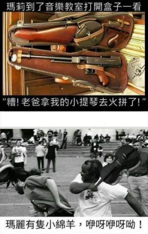

# 瑪莉到了音樂教室打開盒子一看：糟！老爸拿我的小提琴去火拼了

**一句話**：「瑪莉到了音樂教室打開盒子一看」——小提琴盒裡裝的是一把衝鋒槍。「糟！老爸拿我的小提琴去火拼了！」下一格是暴動現場，有人拿著小提琴當武器揮向別人：「瑪麗有隻小綿羊，咩呀咩呀呦！」

## 🍸 笑點解說
- **梗在哪**：父女都習慣用小提琴盒裝東西——爸爸裝槍、女兒裝小提琴。兩個盒子拿錯了：女兒上音樂課打開是一把槍，爸爸只好拿著小提琴去火拼。
