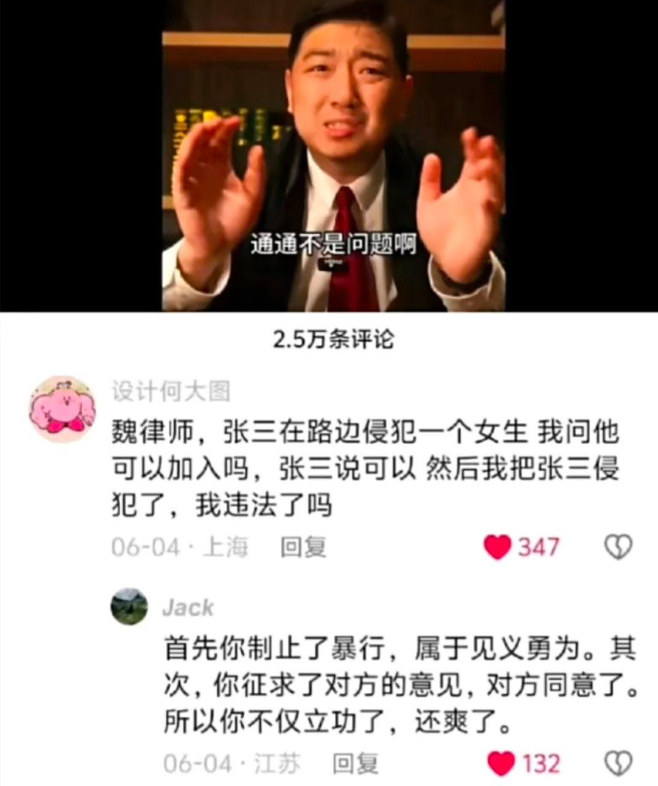

# 魏律師，張三在路邊侵犯女生，我問他可以加入嗎……——「你不僅立功了，還爽了」

**一句話**：律師影片底下有人問：「張三在路邊侵犯一個女生，我問他可以加入嗎，他說可以，然後我把張三侵犯了，我違法了嗎？」有人回：「首先你制止了暴行，屬於見義勇為；其次你徵求了對方的意見，對方同意了。所以你不僅立功了，還爽了。」

## 🍸 笑點解說
- **梗在哪**：這是奇怪的普法知識。「張三」是中國網路普法影片裡固定的虛構犯罪者。回覆的人一本正經地套用法律概念：見義勇為、取得同意，把一件荒唐的事分析成「完全合法」，還多了一句「還爽了」。法律用語的正經與內容的荒謬互相衝突，就是笑點。
