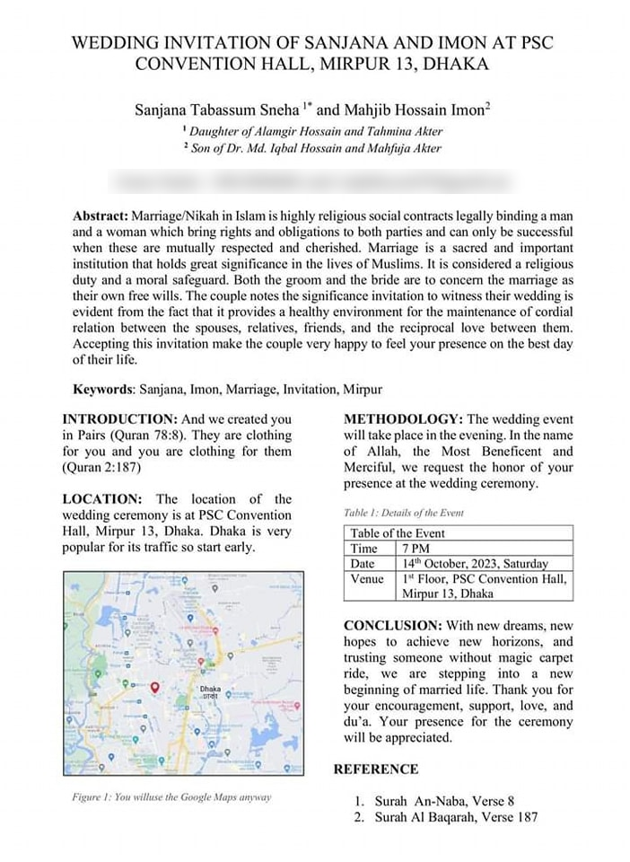

# 寫成論文格式的婚禮邀請函——摘要、方法、結論、參考文獻一個都不能少

**一句話**：一張婚禮邀請函完全照學術論文排版：標題、作者與上標所屬單位、Abstract、Keywords、Introduction、Methodology、Table 1 活動資訊、Figure 1 地圖、Conclusion、Reference。

## 🍸 笑點解說
- **梗在哪**：連結婚都寫得像投稿論文。作者欄的上標標的是「某某人的女兒／兒子」，Location 段還提醒「那一帶很塞，早點出發」，Figure 1 的圖說寫「反正你們都會用 Google Maps」，參考文獻引的是經文。一本正經的格式配上婚禮的內容，反差就是笑點。
- 原圖上的電話與 email 已經打碼。
