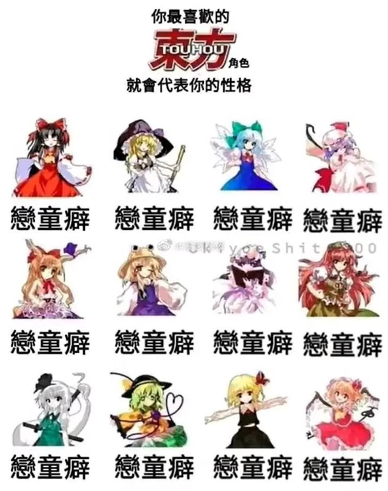

# 你最喜歡的東方角色就會代表你的性格——戀童癖、戀童癖、戀童癖……

**一句話**：「你最喜歡的東方角色就會代表你的性格」——十二個角色底下全部寫著同一個答案：戀童癖。

## 🍸 笑點解說
- **梗在哪**：仿「選角色看性格」的心理測驗，但不管選誰結果都一樣，暗諷喜歡玩、看東方的人全是戀童癖。東方的角色在設定上動輒幾百、上千歲，但原作者 ZUN 的畫風扭曲難辨，網友的二創常把她們畫成小女孩的樣子，於是有了這個刻板印象。
