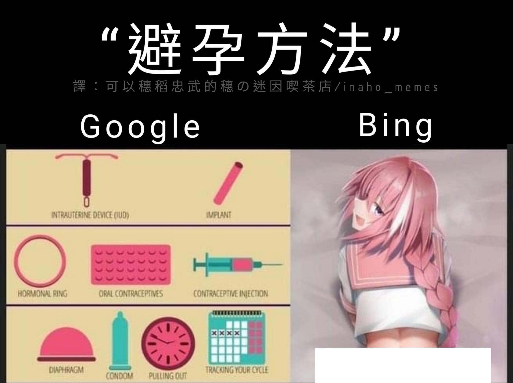

# 「避孕方法」——Google 給你一整張衛教圖，Bing 給你一個男孩子

**一句話**：搜尋「避孕方法」，Google 列出子宮內避孕器、口服避孕藥、保險套等正經的醫療選項；Bing 則給了一張粉紅長髮、穿水手服的角色圖。

## 🍸 笑點解說
- **梗在哪**：Bing 那張是《Fate/Apocrypha》的阿斯托爾福（Astolfo），外表像女孩子，其實是男的。所以 Bing 的「避孕方法」是：跟男的發生關係，就不會懷孕。Google 老老實實給醫學答案，Bing 給的卻是網路上的歪理。
