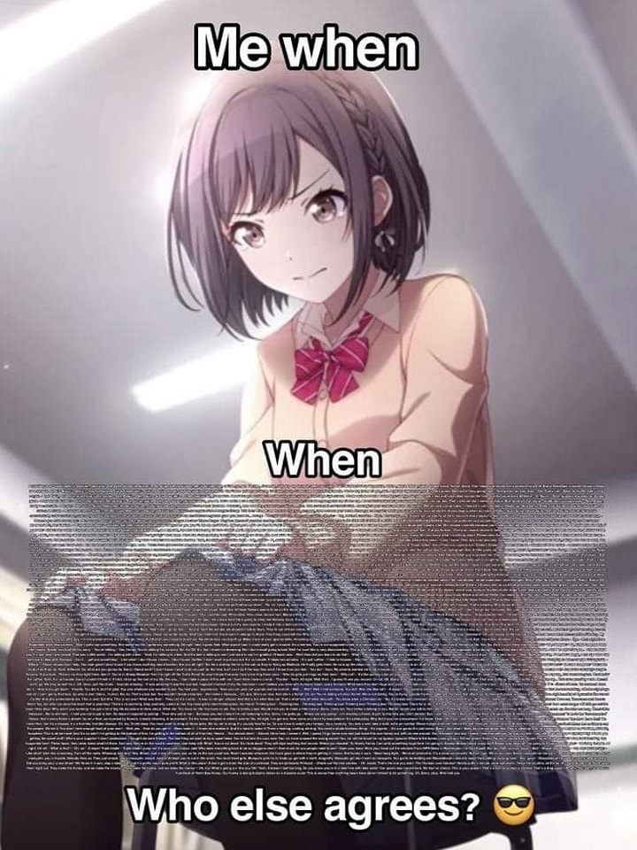

# Me when [一整面小作文] Who else agrees? 😎

**一句話**：手遊《世界計畫 繽紛舞台！feat. 初音未來》的東雲繪名一臉委屈，底下塞滿密密麻麻、根本看不清的一大段文字，最後問「還有誰同意？😎」

## 🍸 笑點解說
- **梗在哪**：這是在酸網路「小作文」。簡單一句「他欺負我」或「我沒錯」很難讓人信服，於是寫的人堆砌細節、用回憶錄的方式夾敘夾議，情緒字眼濃到滿出來，把自己包裝成受害者或正義的一方，好博取同情。圖上那片小到看不清的字牆，就是這種小作文的樣子——而且最後還要大家表態「誰同意」。
