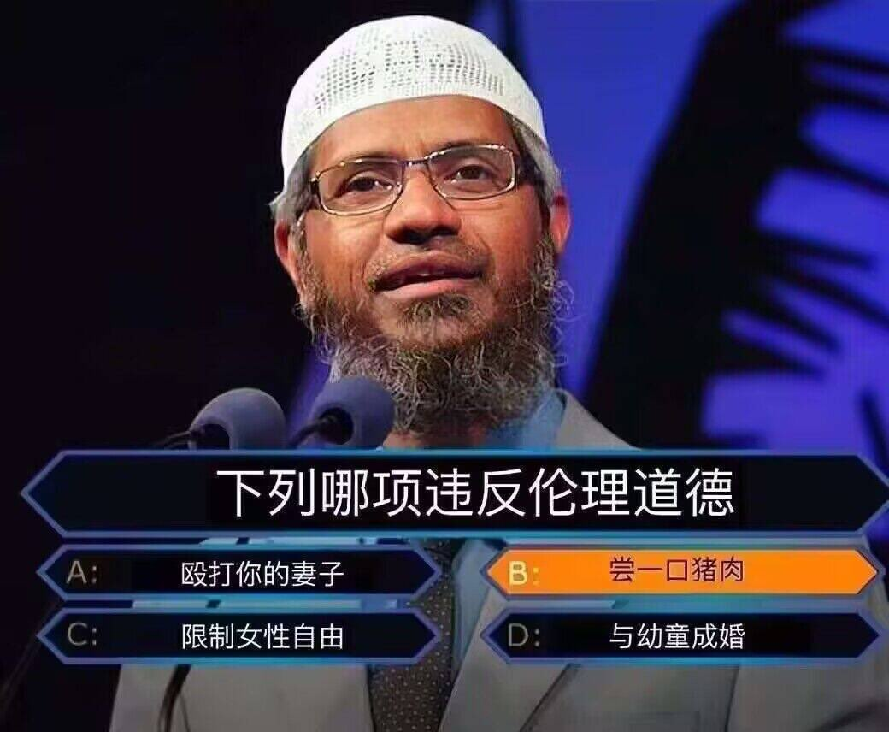

# 下列哪項違反倫理道德？A 毆打妻子 B 嘗一口豬肉 C 限制女性自由 D 與幼童成婚

**一句話**：宗教講者站在百萬大富翁式的題目前：「下列哪項違反倫理道德？」四個選項是毆打妻子、嘗一口豬肉、限制女性自由、與幼童成婚——被選起來的答案是 B「嘗一口豬肉」。

## 🍸 笑點解說
- **梗在哪**：嘲諷某些宗教的道德標準本末倒置：其他三項才是真正不能做的事，卻在某些教義裡被允許；偏偏「吃一口豬肉」被當成違反倫理道德。
