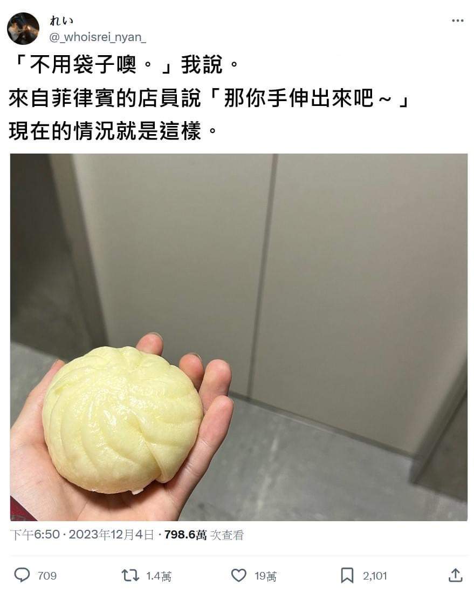
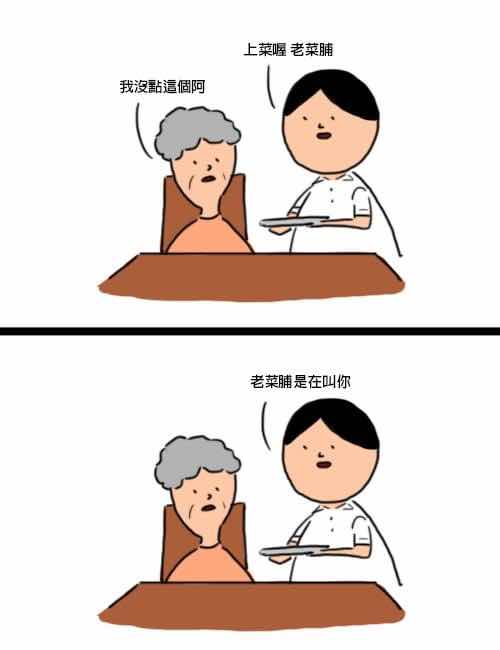
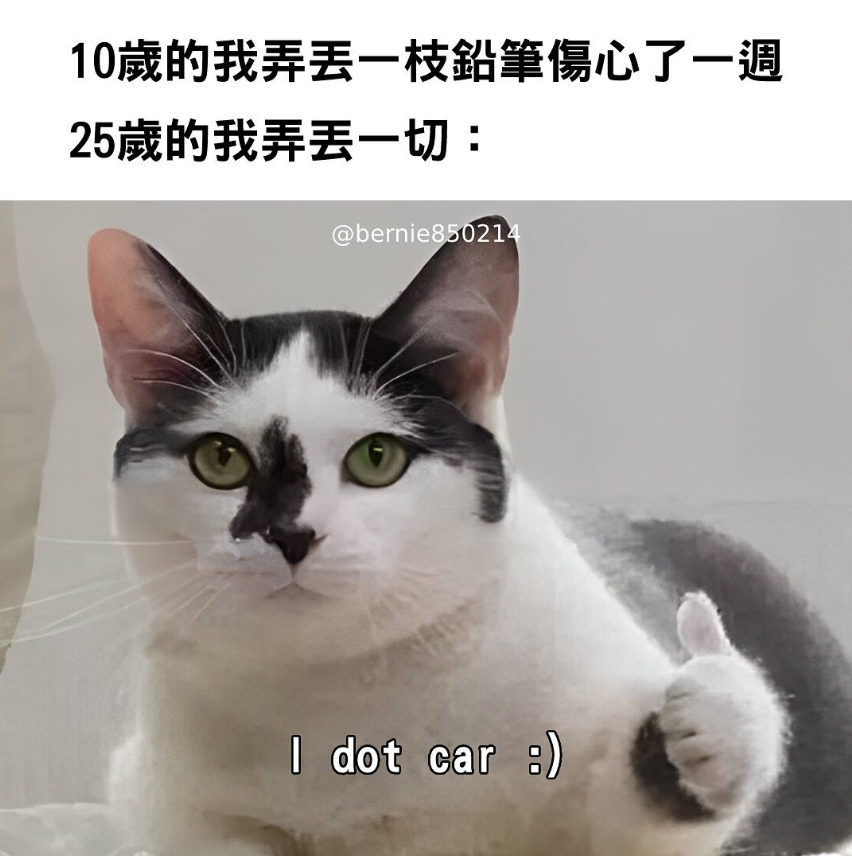

<!-- 此檔由 tools/build_menu.py 自動生成，請勿手動修改 -->

# 🎲 調酒師今日精選

[⬅ 回酒館大廳](../README.md) ・ [📋 總表](index.md) ・ [🏷️ 標籤](tags.md) ・ [🍸 看不懂專區](explained.md)

每次執行 `tools/build_menu.py` 會依當天日期（2026-09-29）隨機抽出 12 杯，不含需斟酌的內容。

<table>
<tr>
<td align="center" valign="top" width="33%"> <a href="../memes/m2524.md">台灣機車按鈕全圖解：戰鬥邀請按鈕</a> 👀 ★</td>
<td align="center" valign="top" width="33%"> <a href="../memes/m1180.md">家裡已經有肉桂捲了</a> 👀 ★</td>
<td align="center" valign="top" width="33%"> <a href="../memes/m0029.md">我比較喜歡正面回饋</a> 🔤 ★</td>
</tr>
<tr>
<td align="center" valign="top" width="33%"> <a href="../memes/m0306.md">我家人追的電影 vs 我追的電影</a> 👀 ★</td>
<td align="center" valign="top" width="33%"> <a href="../memes/m2818.md">不用袋子：那你手伸出來吧</a> 👀 ★</td>
<td align="center" valign="top" width="33%"> <a href="../memes/m2522.md">重新思考你的飲食：1500 大卡 vs 124 兆大卡</a> 👀 ★</td>
</tr>
<tr>
<td align="center" valign="top" width="33%"> <a href="../memes/m0316.md">He's a smooth operator</a> 🔤🧠 ★★</td>
<td align="center" valign="top" width="33%"> <a href="../memes/m3462.md">上菜喔，老菜脯——老菜脯是在叫你</a> 🔤 ★★</td>
<td align="center" valign="top" width="33%"> <a href="../memes/m1532.md">當男朋友跟你吵架等你道歉</a> 👀 ★</td>
</tr>
<tr>
<td align="center" valign="top" width="33%"> <a href="../memes/m3127.md">10 歲弄丟鉛筆傷心一週，25 歲弄丟一切：I dot car</a> 👀 ★</td>
<td align="center" valign="top" width="33%"> <a href="../memes/m3533.md">老媽，表哥來了……</a> 👀 ★</td>
<td align="center" valign="top" width="33%"> <a href="../memes/m1066.md">甲方：我們的要求這麼簡單</a> 👀 ★</td>
</tr>
</table>
