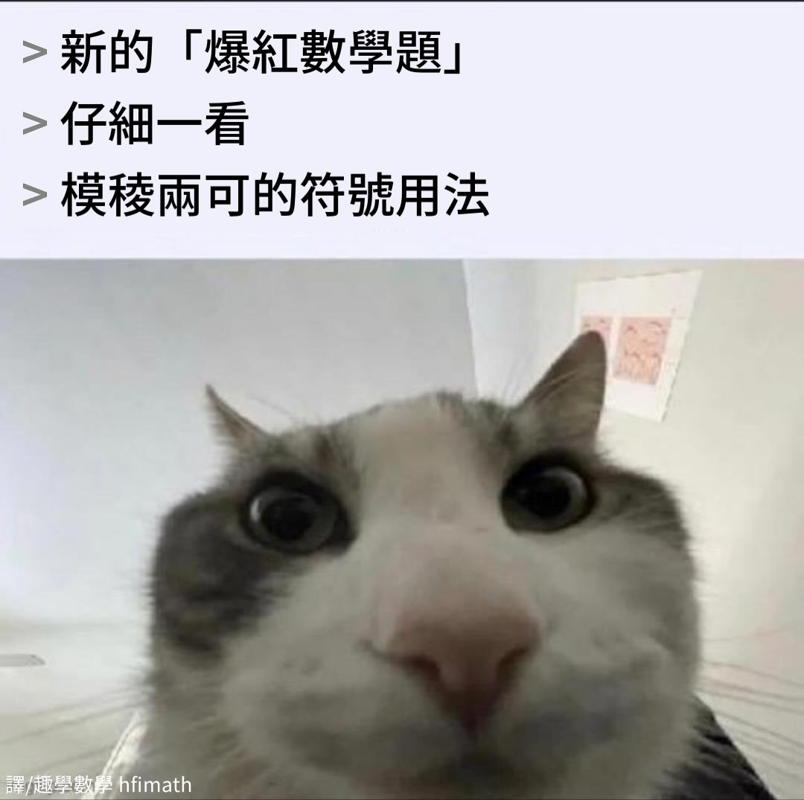
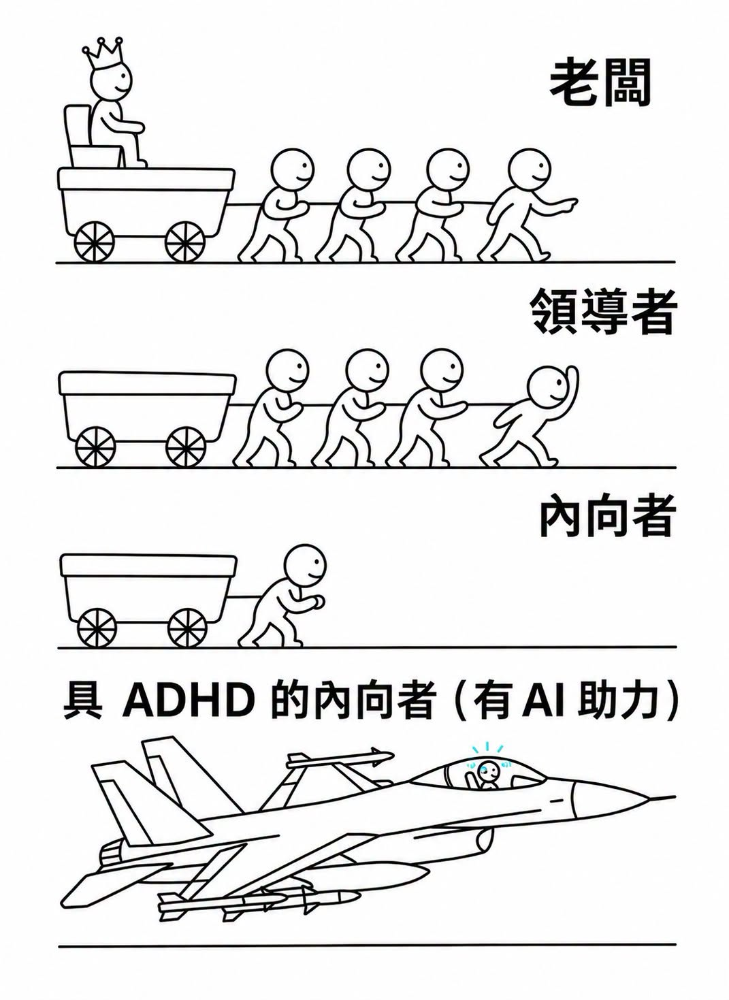
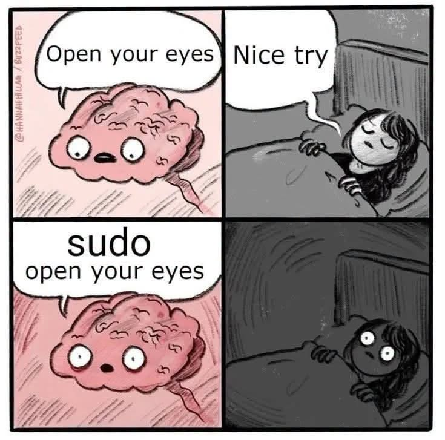
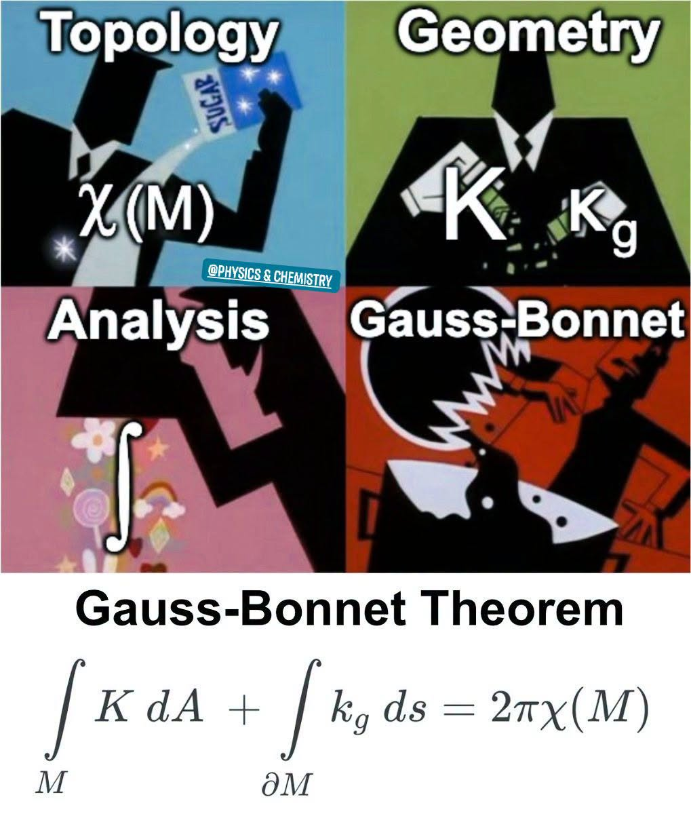
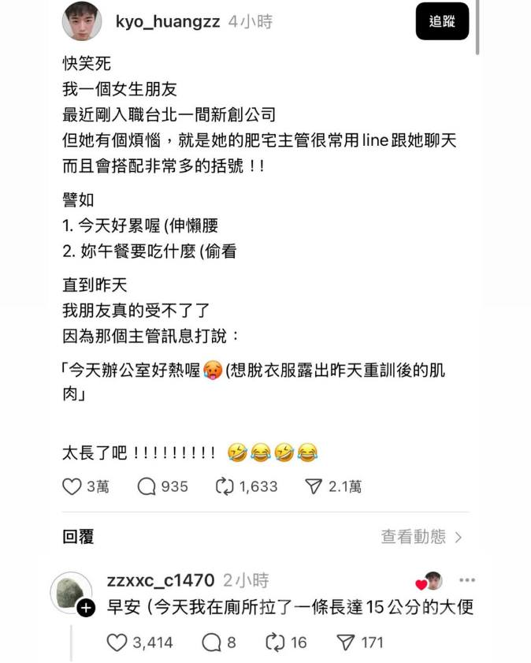
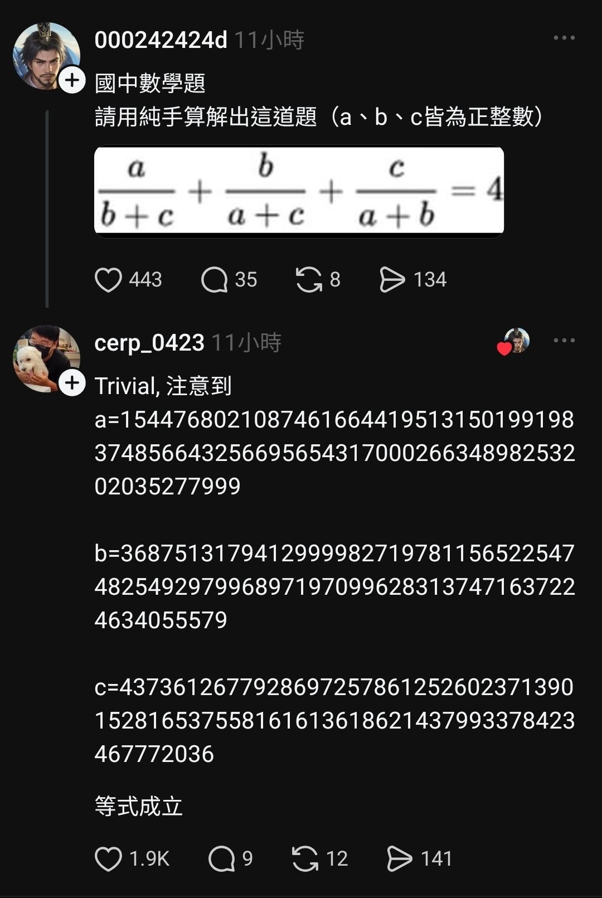
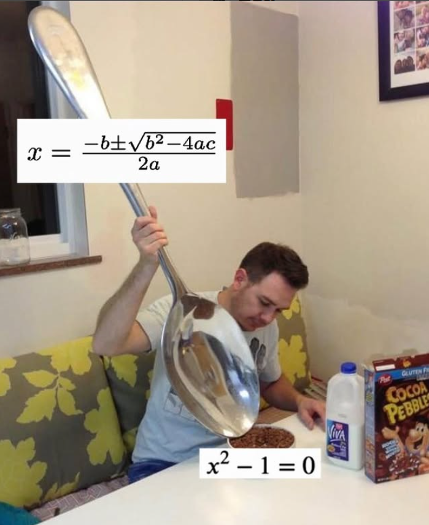
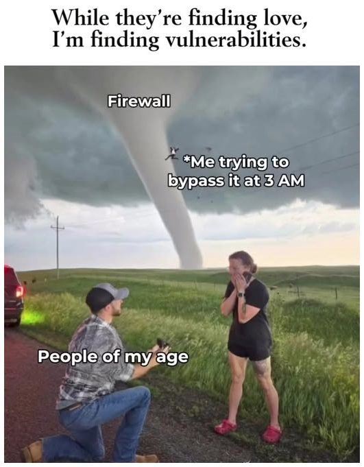

<!-- 此檔由 tools/build_menu.py 自動生成，請勿手動修改 -->

# 🎲 調酒師今日精選

[⬅ 回酒館大廳](../README.md) ・ [📋 總表](index.md) ・ [🏷️ 標籤](tags.md) ・ [🍸 看不懂專區](explained.md)

每次執行 `tools/build_menu.py` 會依當天日期（2026-09-26）隨機抽出 12 杯，不含需斟酌的內容。

<table>
<tr>
<td align="center" valign="top" width="33%"> <a href="../memes/m0148.md">新的爆紅數學題</a> 👀 ★</td>
<td align="center" valign="top" width="33%"> <a href="../memes/m0041.md">具 ADHD 的內向者（有 AI 助力）</a> 👀 ★</td>
<td align="center" valign="top" width="33%"> <a href="../memes/m0470.md">三分之一 = o.333333</a> 👀 ★</td>
</tr>
<tr>
<td align="center" valign="top" width="33%"> <a href="../memes/m0269.md">他不會搞砸（異世界主角圖鑑）</a> 👀 ★★</td>
<td align="center" valign="top" width="33%"> <a href="../memes/m0074.md">數學家的所謂「進行研究」</a> 👀 ★</td>
<td align="center" valign="top" width="33%"> <a href="../memes/m0616.md">我還是會續簽下去</a> 👀 ★★</td>
</tr>
<tr>
<td align="center" valign="top" width="33%"> <a href="../memes/m0028.md">sudo 打開你的眼睛</a> 🧠👀 ★★</td>
<td align="center" valign="top" width="33%"> <a href="../memes/m0004.md">高斯–博內定理是怎麼煉成的</a> 🧠 ★★★</td>
<td align="center" valign="top" width="33%"> <a href="../memes/m0434.md">主管的括號動作太長了</a> 👀 ★</td>
</tr>
<tr>
<td align="center" valign="top" width="33%"> <a href="../memes/m0285.md">國中數學題：a/(b+c)+b/(a+c)+c/(a+b)=4</a> 🧠 ★★★</td>
<td align="center" valign="top" width="33%"> <a href="../memes/m0698.md">用公式解解 x² − 1 = 0</a> 👀 ★</td>
<td align="center" valign="top" width="33%"> <a href="../memes/m0577.md">他們在找真愛，我在找漏洞</a> 👀 ★</td>
</tr>
</table>
