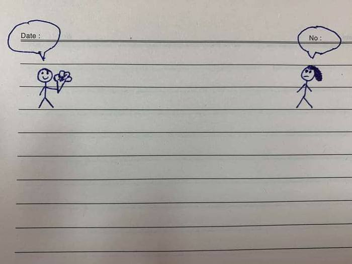

<!-- 此檔由 tools/build_menu.py 自動生成，請勿手動修改 -->

# 🎲 調酒師今日精選

[⬅ 回酒館大廳](../README.md) ・ [📋 總表](index.md) ・ [🏷️ 標籤](tags.md) ・ [🍸 看不懂專區](explained.md)

每次執行 `tools/build_menu.py` 會依當天日期（2026-09-30）隨機抽出 12 杯，不含需斟酌的內容。

<table>
<tr>
<td align="center" valign="top" width="33%"> <a href="../memes/m2750.md">宇宙有智慧生物嗎？地球：笨蛋太多所以沒有</a> 👀 ★</td>
<td align="center" valign="top" width="33%"> <a href="../memes/m1330.md">海綿寶寶某一集的片段，看起來像文藝復興畫作</a> 👀 ★</td>
<td align="center" valign="top" width="33%"> <a href="../memes/m0521.md">Linux From Scratch for Babies</a> 👀 ★★</td>
</tr>
<tr>
<td align="center" valign="top" width="33%"> <a href="../memes/m2835.md">謝謝妳對我那麼冷淡，我感覺涼快多了</a> 🔤 ★</td>
<td align="center" valign="top" width="33%"> <a href="../memes/m3243.md">筆記本上的 Date 和 No 欄位</a> 🔤 ★</td>
<td align="center" valign="top" width="33%"> <a href="../memes/m0298.md">超時空輝夜姬我看的是黑毛</a> 👀 ★★</td>
</tr>
<tr>
<td align="center" valign="top" width="33%"> <a href="../memes/m2929.md">勇者去世後 30 年：不對</a> 👀 ★★</td>
<td align="center" valign="top" width="33%"> <a href="../memes/m1843.md">等等，我是叫的優香和愛麗絲到我辦公室來，你們是誰？</a> 👀 ★★</td>
<td align="center" valign="top" width="33%"> <a href="../memes/m0707.md">天哪這根本就是我</a> 👀 ★</td>
</tr>
<tr>
<td align="center" valign="top" width="33%"> <a href="../memes/m2608.md">想用 Play 商店的 App 駭鄰居 Wi-Fi</a> 👀 ★</td>
<td align="center" valign="top" width="33%"> <a href="../memes/m3610.md">讓人們遵守交通規則的唯一方法：紅綠燈裝加特林機槍</a> 👀 ★</td>
<td align="center" valign="top" width="33%"> <a href="../memes/m0203.md">一堆證照 vs 隨便一個 Linux 使用者</a> 👀 ★</td>
</tr>
</table>
